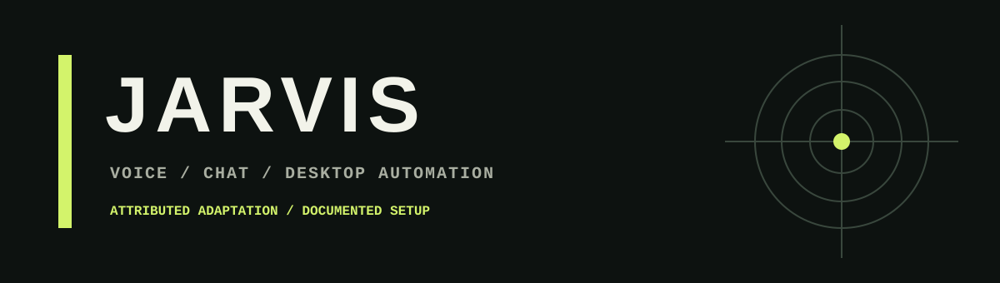

<div align="center">
  
</div>

# JARVIS


JARVIS has a **web app** for browser chat and voice controls, plus a **Python desktop app** for local voice and computer-control features. The desktop app is adapted from [MARK XXXIX-OR by FatihMakes](https://github.com/FatihMakes/Mark-XXXIX-OR). Original attribution and project notes are preserved in [docs/UPSTREAM.md](docs/UPSTREAM.md).

| Edition | Purpose | Requirements |
| --- | --- | --- |
| Web | Chat, dictation and read-aloud in a browser | Current browser and an OpenRouter key |
| Desktop | Voice, local audio and computer-control experiments | Windows, Python 3.11 or 3.12, microphone and provider keys |

## Web app

**[Launch JARVIS Web](https://dwij-jarvis.antideploy.com)** · **[Desktop setup guide](docs/RUN_LOCALLY.md)**

The web edition lives in `web/` and connects directly to OpenRouter using your own API key. The key remains in page memory and is cleared on reload or disconnect; conversation history stays in your browser until you clear it. It requires explicit provider consent before connecting and includes chat, dictation in supported browsers, read-aloud, cancellation, mobile layout, an aggregate view counter and site-specific appreciation progress, and project-specific privacy, terms, storage, and refund pages. [Web setup, features, and deployment instructions](docs/WEB_APP.md).

To run the web app locally without installing desktop packages:

```powershell
py -3.12 -m http.server 8765 --bind 127.0.0.1 --directory web
```

Open **http://127.0.0.1:8765**. Desktop control stays in the local app; the web version does not expose it over the internet.

## Run locally

**Start here: [Complete step-by-step Windows setup guide](docs/RUN_LOCALLY.md).** It covers installing Python and Git, downloading JARVIS, dependencies, API keys, microphone settings, first launch, checks, FFmpeg, updates, and troubleshooting.

Use **Python 3.11 or 3.12** on Windows, with a microphone and speakers. Windows is the tested platform. Some modules support macOS/Linux, but those platforms have not been validated; game updates are Windows-only.

```powershell
py -3.12 -m venv .venv
.venv\Scripts\python.exe setup.py
.venv\Scripts\python.exe main.py
```

On first launch, enter your Gemini and OpenRouter API keys in the setup screen and select your OS. Keys are stored locally in `config/api_keys.json`, which is excluded from Git. `config/api_keys.example.json` documents the format. Personal memory and temporary files are also excluded. The optional `face.png` image is not supplied; the interface works without it.

Audio/video conversions need FFmpeg installed and available on PATH. Live AI features need working API keys, network access, and access to the configured provider models. Provider limits and model availability may vary.

The desktop edition uses local audio and desktop control. The separate `web/` edition is designed for Antideploy static hosting; see [the web guide](docs/WEB_APP.md).

## Checks

```powershell
.venv\Scripts\python.exe -m unittest discover -s tests -v
.venv\Scripts\python.exe -m pip check
```

GitHub Actions runs dependency validation, focused static checks, and ten offline regression checks on Windows/Python 3.12. Tests cover first-run GUI startup, module imports, configuration, CSV/Excel reading, transcript API integration with a mock, audio queue backpressure, and Live API configuration validation. They do not record audio, call paid APIs, or perform desktop actions.

`requirements.txt` is the primary dependency list; `requirements_new.txt` is a compatibility alias. `requirements-windows.lock.txt` records the exact packages tested locally on Windows/Python 3.12. To reproduce that environment, install the lock file instead of `requirements.txt`.

## Fixes in this import

- Added missing GUI/document dependencies and Windows dependency markers.
- Replaced the copied, broken virtual environment with reproducible setup instructions.
- Made setup safe to import and independent of the current working directory.
- Fixed CSV decoding arguments and YouTube transcript calls for the installed API.
- Deferred OpenRouter credential loading until use, allowing first-run imports.
- Added missing-config OS detection and a Windows-only game-update guard.
- Fixed audio queue overflow handling and enabled voice transcriptions.
- Added offline checks and GitHub Actions checks, with no deployment workflow.

## Validation limits

A real browser-to-OpenRouter conversation and a Gemini Live audio response have been verified. Twelve web browser tests run separately from the ten desktop tests. Physical microphone/playback, browser control, and system-changing desktop actions have not been tested end to end. Some desktop modules still use the deprecated `google-generativeai` SDK, which emits a warning. Passing checks does not establish that every external service or device operation will work.

## License and attribution

The supplied upstream README states **Creative Commons Attribution-NonCommercial 4.0 (CC BY-NC 4.0)**, for personal and non-commercial use. Preserve FatihMakes attribution and those terms. This repository contains local fixes to the supplied source; see [the upstream README](docs/UPSTREAM.md) for the original notice.

